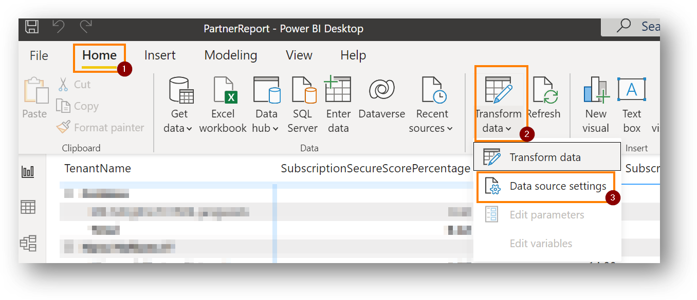
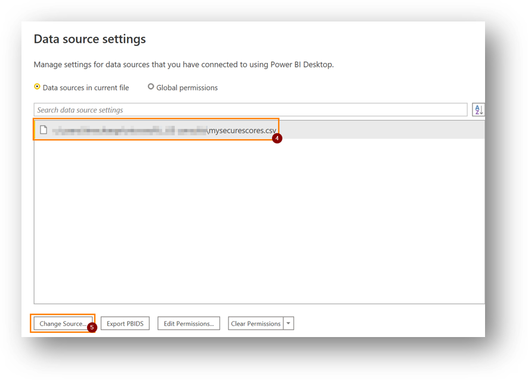

# Mission65

## Extracting the information from your tenants

1. (On Windows) open powershell (in the folder 01.ExtractSecureScore)
2. run the file `Mission65SecureScore.ps1`
3. You'll be asked to authenticate by logging into the browser/popup
4. The account that you use to login, needs tho have access to the subscriptions that you want to report on. The minimal role that you need is: `Security Reader` 
5. The resulting file will be written in the same folder (as the script) and will have the current date (formatted as: yyyy-MM-dd_HH-mm) appended to the filename.

> The resulting file can then be used in the next phase with the PowerBI report.

## Getting to the insights

> Using the extracted info in the report

Getting to the insights is very easy, as we have done the heavy lifting for you: 
- We have prepared a report that can be used with the extract the script that can be found in folder `01.ExtractSecureScore`
- “All” that needs to happen, open the report and point the data source to the location of the exported file by following these steps: 

> Click on 1, 2 and 3, as shown in the following image

> Then change the data source: by changing 4 and clicking on 5, where you’ll be able to browse for the file that you generated earlier!
(The extracted file can be found in the folder `01.ExtractSecureScore` and contains the current date in the filename.)

> Finally click ok in the first window, close in the second one and you should be good to go!
